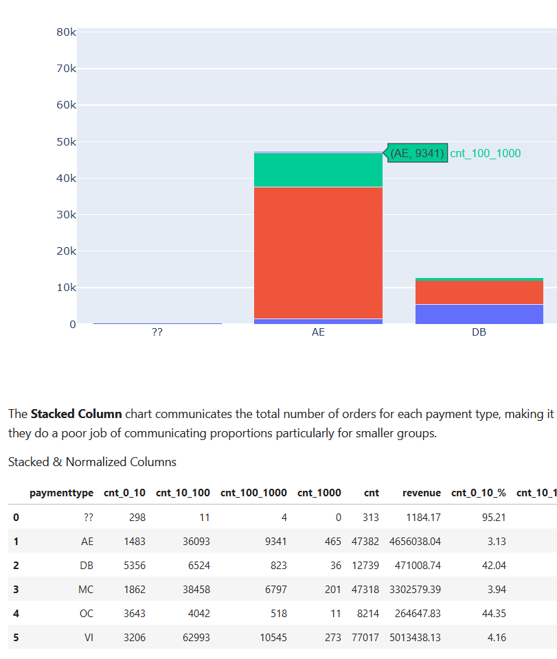
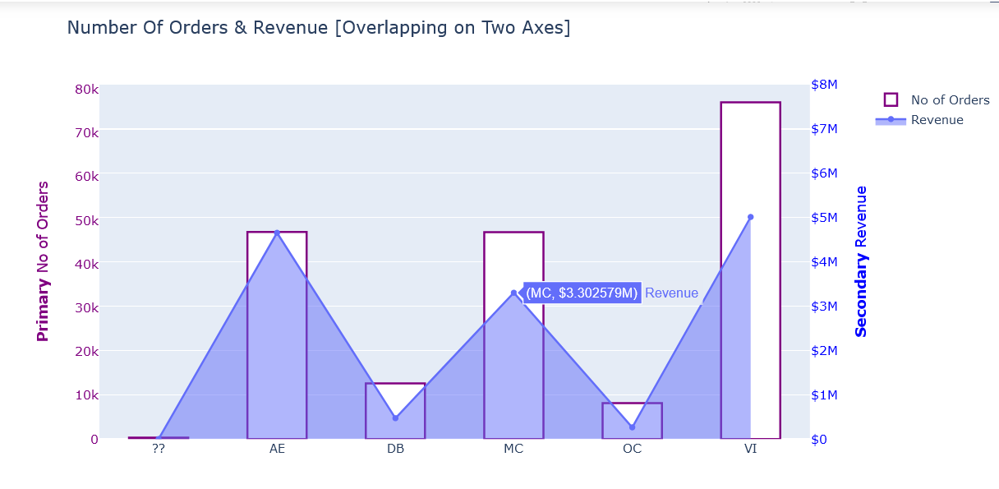
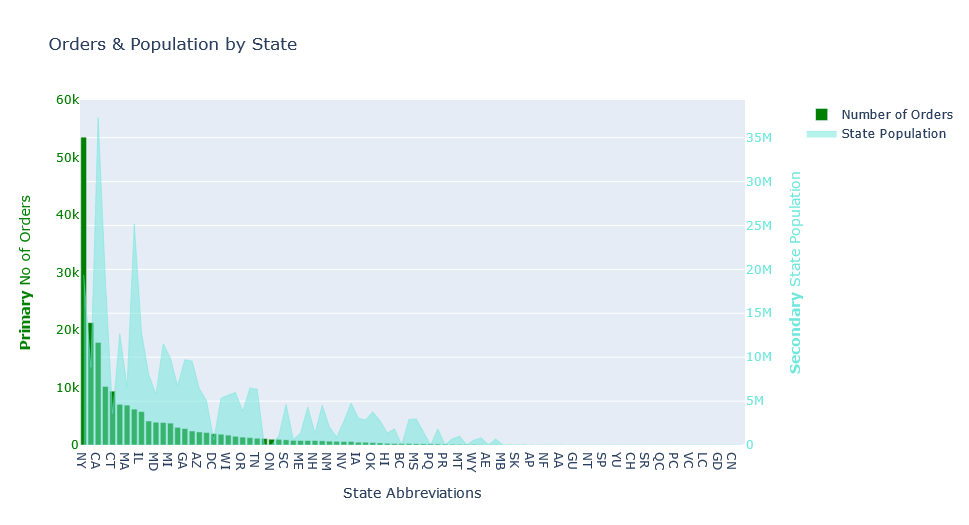

# dataanalysis-using-sql-and-dash
Data analysis using SQL &amp; Dash

# Reference Book Used

https://www.wiley.com/en-us/Data+Analysis+Using+SQL+and+Excel%2C+2nd+Edition-p-9781119021438

# Details
Wanted to learn dash & further refine my SQL querying for Data Analysis, hence used this book to replicate all scenerios using SQL and used dash instead of excel for charting & plotting.

# Plots & Charts Using Plotly/Dash

# NoteBook-Links
https://gesis.mybinder.org/binder/v2/gh/shraddha-kr/dataanalysis-using-sql-and-dash/68c533d481902a46e9a4f73e3b1ffc8ddd10dc3c
